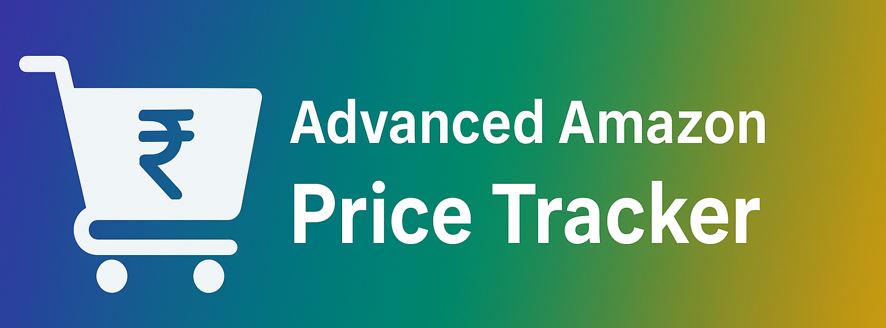

<!-- COVER IMAGE -->
<p align="center">
  
</p>

<!-- PROJECT TITLE -->
<h1 align="center">🛒 Advanced Amazon Price Tracker API</h1>

<!-- BADGES -->
<p align="center">
  <!-- License -->
  

  <!-- Language -->
  

  <!-- Framework -->
  

  <!-- Database -->
  

  <!-- Scraping -->
  

  <!-- HTTP -->
  

  <!-- Validation -->
  

  <!-- Logging -->
  

  <!-- Env -->
  
</p>


---

## 🚀 Overview
The **Advanced Amazon Price Tracker API** is a powerful 📡 and beginner-friendly 👩‍💻 project built using **FastAPI**, **MongoDB**, **BeautifulSoup**, and **Rich**.  
It scrapes 🕷️ Amazon product data, stores it in a database 🗄️, and continuously updates prices in real-time ⏱️.

✨ This project is ideal for:  
- 🎓 Freshers showcasing skills to land a job  
- 🛍️ Tracking wishlist product prices easily  
- ⚡ Learning **Web Scraping + Backend APIs + Databases**  

---

## 📂 Project Structure
```

.
├── api
│   └── main.py       # ⚡ FastAPI server (CRUD operations)
├── update
│   └── main.py       # 🔄 Background price updater service
├── requirements.txt  # 📦 Project dependencies

````

---

## 🛠️ Tech Stack & Usage

| Tech        | Purpose |
|-------------|---------|
| **FastAPI** ⚡ | REST API framework for building endpoints |
| **MongoDB** 🍃 | Database to store product details |
| **BeautifulSoup4** 🍲 | Web scraping Amazon product info |
| **Requests** 🌐 | Fetching web pages |
| **Rich** 🎨 | Beautiful console logging & debugging |
| **Dotenv** 🔑 | Environment variable management |

---

## ⚙️ Installation & Running (Local Machine)

### 🔧 Prerequisites
- 🐍 Python 3.9+
- 🍃 MongoDB (local or cloud, e.g. MongoDB Atlas)
- 🐧 Linux / 🪟 Windows / 🍎 Mac
- 🐙 Git

### 📝 Steps

```bash
# 1️⃣ Clone this repository
git clone https://github.com/OWNER/REPO.git
cd REPO

# 2️⃣ Create virtual environment
python -m venv venv
source venv/bin/activate   # On Linux/Mac 🍎🐧
venv\Scripts\activate      # On Windows 🪟

# 3️⃣ Install dependencies
pip install -r requirements.txt

# 4️⃣ Add Mongo URI
echo "MONGO_URI=your_mongo_connection_string" > .env

# 5️⃣ Run API Server 🚀
uvicorn api.main:app --reload

# 6️⃣ Run Price Updater 🔄 (in another terminal)
python update/main.py
````

---

## ☁️ Deploy on AWS EC2

### 1. Launch EC2

* Go to AWS console → EC2 → Launch instance
* Choose **Ubuntu 22.04 LTS** (free tier)
* Allow inbound rules for ports: `22 (SSH)` & `8000 (API)`

### 2. Connect to EC2

```bash
ssh -i your-key.pem ubuntu@your-ec2-public-ip
```

### 3. Install dependencies

```bash
# Update system
sudo apt update && sudo apt upgrade -y

# Install Python & Git
sudo apt install python3 python3-pip python3-venv git -y
```

### 4. Clone repo & setup

```bash
git clone https://github.com/OWNER/REPO.git
cd REPO

python3 -m venv venv
source venv/bin/activate

pip install -r requirements.txt
```

### 5. Setup Mongo URI

```bash
echo "MONGO_URI=your_mongo_connection_string" > .env
```

### 6. Run FastAPI server on EC2

```bash
uvicorn api.main:app --host 0.0.0.0 --port 8000
```

Now visit:
👉 `http://your-ec2-public-ip:8000/docs`

### 7. Run updater in background

```bash
nohup python update/main.py &
```

---

## 📡 API Endpoints

| Method | Endpoint       | Description                 |
| ------ | -------------- | --------------------------- |
| `GET`  | `/`            | 👋 Welcome route            |
| `GET`  | `/products`    | 📃 Show product list        |
| `GET`  | `/allproducts` | 📊 Show all product details |
| `POST` | `/add`         | ➕ Add product by URL        |
| `GET`  | `/view?id=...` | 🔍 View product details     |
| `POST` | `/remove`      | ❌ Remove product by ID      |

---

## 🌱 Future Upgrades

* 🎨 React Frontend for modern UI
* ☁️ Deploy on AWS with **Docker + Nginx**
* 📩 Notifications (SMTP, WebSockets, Push)
* 📊 Price trend graph visualization with Chart.js

---

## 🤝 Contributing

Contributions are welcome! 💌 Feel free to open **Issues** or submit **Pull Requests**.

---

## 📜 License

📄 This project is licensed under the [MIT License](LICENSE).

---

<p align="center">💡 Built with ❤️ by <a href="https://github.com/rax-2">Pinaka</a></p>

---
